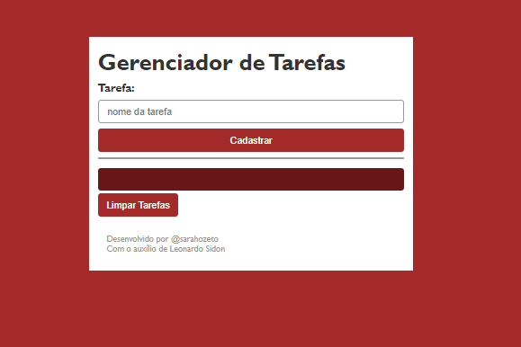

# INDÍCE
[Lista De Tarefas](lista-de-tarefas) 
[Funcionalidades](#funcionalidades)  
[Tecnologias utilizadas](#tecnologias-utilizadas)  
[Fontes consultadas](#fontes-consultadas)  
[Autores](#autores) 

# Lista de Tarefas

# Funcionalidades

# Tecnologias Utilizadas
No código acima foram usadas as seguintes tecnologias:
* HTML 5 
* CSS 3
* PHP
* XAMPP
* GIT 
* GITHUB

# Fontes Consultadas
[Projeto Gerenciador de Tarefas](https://pucpredu-my.sharepoint.com/personal/leonardo_sidon_grupomarista_org_br/_layouts/15/stream.aspx?id=%2Fpersonal%2Fleonardo%5Fsidon%5Fgrupomarista%5Forg%5Fbr%2FDocuments%2FVideos%2FProjeto%20%2D%20Gerenciador%20de%20Tarefas%2Emp4&ga=1&referrer=StreamWebApp%2EWeb&referrerScenario=AddressBarCopied%2Eview)

# Autores
Sarah Ozeto Silva